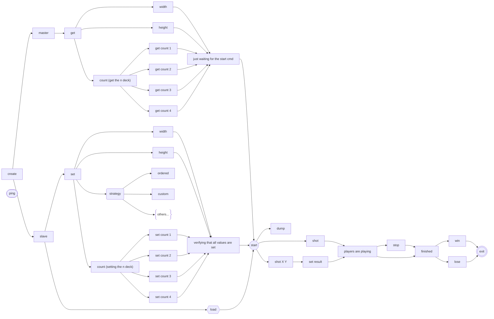

> Здесь пока будут содержаться мои зафиксированные размышления, структура проекта, идеи...

# Сущности
- Ядро игры;
- Хранение поля и кораблей: моего и врага;
- Обработчик комманд;
- Парсер;
- Стратегии;

А теперь подробнее.


## Ядро игры (Kernel)

Здесь содержаться все настройки игры, выбранный тип стратегии, и нужные размеры поля и кораблей.

1. Тип игрока: мастер или слуга(master or slave);
2. Размер поля;
3. Выбранная стратегия;
4. Количество соответственных кораблей;
5. Статус игры: выиграли или нет;
6. Непосредственно собственное поле и поле врага;


## Хранение поля и кораблей (Map)

Данная структура данных должна оптимально хранить информацию о поле, причем с ограничением в 32 Mb. (Макс значений в поле 2\**64 * 2\**64 и их два: один принадлежит нам, другой врагу).\
Каждое поле есть перечень из всех исследованных клеток, в которых находится пустота или часть корабля - может быть, и уже подбитого.
Конечно, было бы гениально реализовать архиватор, который бы сжимал поле до приемлемых размеров и получал нужную область(часть поля) при каком-либо действии, но пока это стоит просто оставить как дополнительную задачу на будущее.\
Поле самостоятельно генерируется исходя из выбранных настроек. (стратегии или соперника, если программа запущена под slave-ом).

Поле: [boost хэш таблица](https://www.boost.org/doc/libs/1_36_0/doc/html/boost/unordered_map.html), которая дает возможность обращаться по ключу, представленного в виде пары координат [x и y](https://stackoverflow.com/questions/32685540/why-cant-i-compile-an-unordered-map-with-a-pair-as-key).


## Обработчик комманд (Proccesor)

Хорошее название, а главное - верное, так как именно он будет заниматься всем: администрирование игры и ее руководство.\
Этот объект отвечает за весь ввод потока и вывода, и - при необходимости, а точнее, если только это возможно - делегирует его другим сущностям.

| Команда                      | Ответ          | Описание |
| -------                      | -----          | --------                                    |
| ping                         |  pong          |   тестовая команда                          |
| exit                         |  ok            |   программа завершается                     |
| create [master,slave]        |  ok            |   создать игру в режиме master или slave соответственно       |
| start                        |  ok            |   старт игры                     |
| stop                         |  ok            |   остановка текущей партии       |
| set width  N                 |  ok/failed     |   установить ширину поля (N положительное, влезает в uint64_t)       |
| get width                    |  N             |   получить длину поля  (N положительное, влезает в uint64_t)      |
| set height N                 |  ok/failed     |   установить высоту поля (N положительное, влезает в uint64_t)        |
| get height                   |  N             |   получить высоту поля  (N положительное, влезает в uint64_t)      |
| set count [1,2,3,4]  N       |  ok/failed     |   установить количество кораблей определенного типа (N положительное, влезает в uint64_t)        |
| get count [1,2,3,4]          |  N             |   получить количество кораблей определенного типа (N положительное, влезает в uint64_t)        |
| set strategy [ordered,custom]|  ok            |   выбрать стратегию для игры        |
| shot X Y                     |  miss/hit/kill |   выстрел по вашим короаблям в координатах (X,Y) (X,Y положительные, влезают в uint64_t)      | 
| shot                         |  X Y           |   вернуть координаты вашего следующего выстрела, в ответе два числа через пробел  (X,Y положительные, влезают в uint64_t)       |
| set result [miss,hit,kill]   |  ok            |   установить результат последнего выстрела программы       |
| finished                     |  yes/no        |   окончена ли текущая партия       |
| win                          |  yes/no        |   являетесь ли вы победителем       |
| lose                         |  yes/no        |   являетесь ли вы проигравшим       |
| dump PATH                    |  ok            |   сохранить размер поля и вашу текущую расстановку кораблей в файл        |
| load PATH                    |  ok            |   загрузить размер поля и расстановку кораблей из файла      |

Немного подробнее
finished - должно вернуть да, если есть однозначно статус победы или проигрыша
win - должно вернуть да, если мы уже гарантировано знаем, что победили, иначе - нет. (кол-во подбитых клеток врага равно начальному количеству заданных кораблей)
lose - должно вернуть да, если мы однозначно проиграли, иначе - нет.

## Парсер (Parser)

Тут все очевидно. Реализован парсер информации о настройках игры и передан в `Processor`.

Пример

```
10 10
1 v 0 0
2 h 3 4
4 h 1 8
```


## Стратегии (Strategy)

Реализованы две стратегии: ordered, custom. Названия сами за себя говорят, так что добавить мне здесь нечего. Пока я не знаю, как именно я их реализую, но они будут как раз отвечать за ходы: какую клетку стоит бить дальше.


## Дерево команд



# UB (Undefined Behavior)
При разработке было не покрыто следующее неопределённое поведение: при отстреле всех существующих ячеек и неправильном информировании программы о попадании возможна ситуация, когда программа отстреляет все ячейке, не выиграв. Это вызовет UB, а точнее - Segmetention fault.
Пример:
```
🏴‍☠️ Welcome to Ship Wars!
create slave
ok
set width 8
ok
set height 4
ok
set count 1 1
ok
start
ok
shot  
0 0
shot
1 1
...
shot
7 3
shot
AddressSanitizer:DEADLYSIGNAL
=================================================================
==22722==ERROR: AddressSanitizer: SEGV on unknown address 0x00000000003f (pc 0x000105d71fe1 bp 0x7ff7ba1b82b0 sp 0x7ff7ba1b8260 T0)
==22722==The signal is caused by a READ memory access.
==22722==Hint: address points to the zero page.
    #0 0x105d71fe1 in Coords::operator==(Coords const&) const+0x41 (ship-wars:x86_64+0x10002bfe1)
    #1 0x105de11a3 in std::__1::__wrap_iter<Coords const*> std::__1::find[abi:v160006]<std::__1::__wrap_iter<Coords const*>, Coords>(std::__1::__wrap_iter<Coords const*>, std::__1::__wrap_iter<Coords const*>, Coords const&)+0x193 (ship-wars:x86_64+0x10009b1a3)
    #2 0x105de0a21 in CustomStrategy::next_()+0xd71 (ship-wars:x86_64+0x10009aa21)
    #3 0x105ddaf13 in CustomStrategy::search_()+0x123 (ship-wars:x86_64+0x100094f13)
    #4 0x105dda947 in CustomStrategy::Shot()+0x1b7 (ship-wars:x86_64+0x100094947)
    #5 0x105d4bff4 in Kernel::Shot()+0x164 (ship-wars:x86_64+0x100005ff4)
    #6 0x105d651e5 in Processor::Shot()+0x2f5 (ship-wars:x86_64+0x10001f1e5)
    #7 0x105d61fbb in Processor::Run(bool)+0xc8b (ship-wars:x86_64+0x10001bfbb)
    #8 0x105d4a057 in main+0x157 (ship-wars:x86_64+0x100004057)
    #9 0x7ff80a1a2417 in start+0x767 (dyld:x86_64+0xfffffffffff6e417)
```