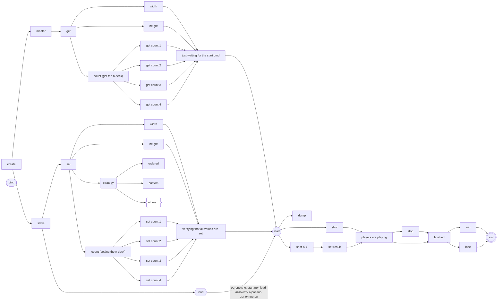
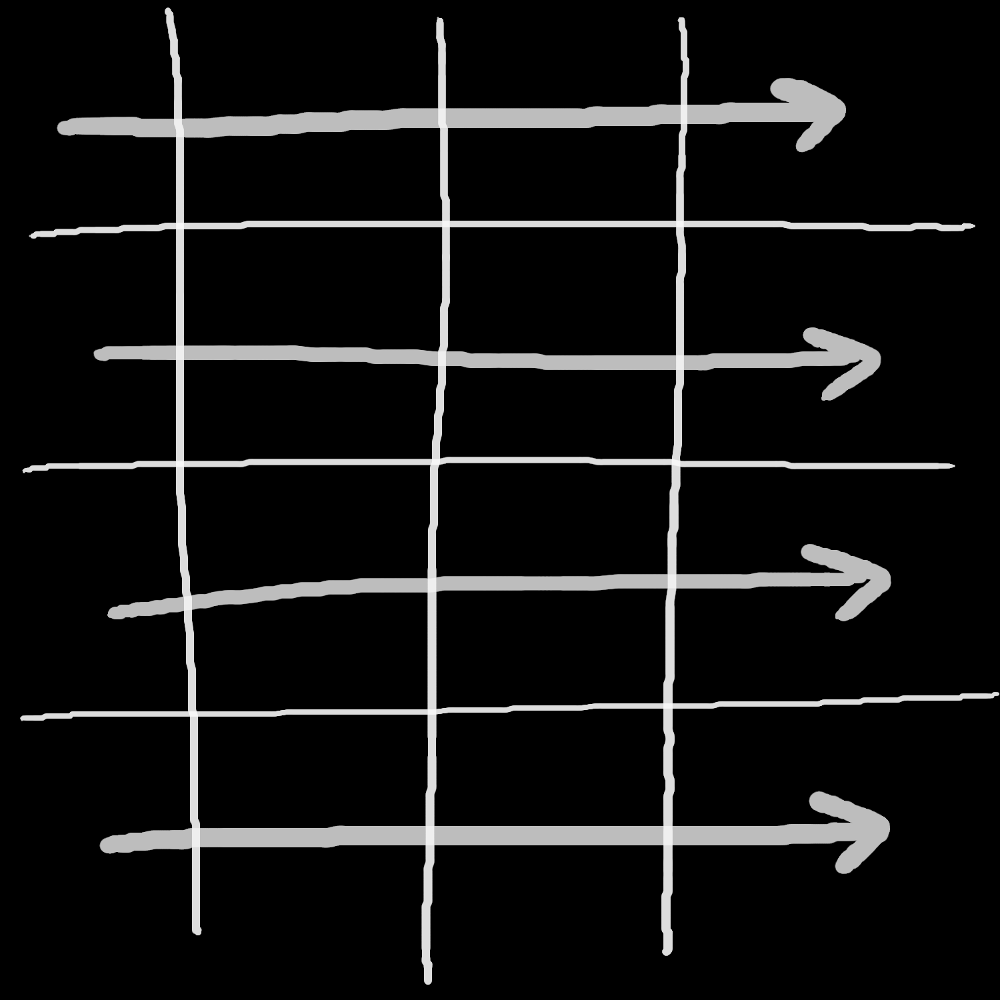
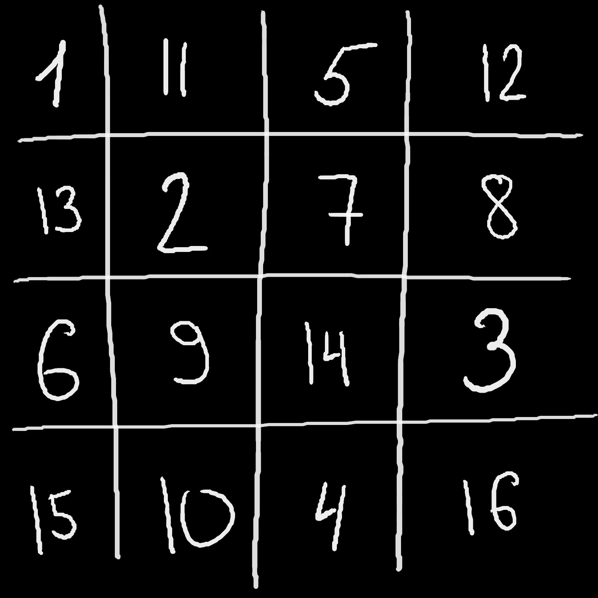
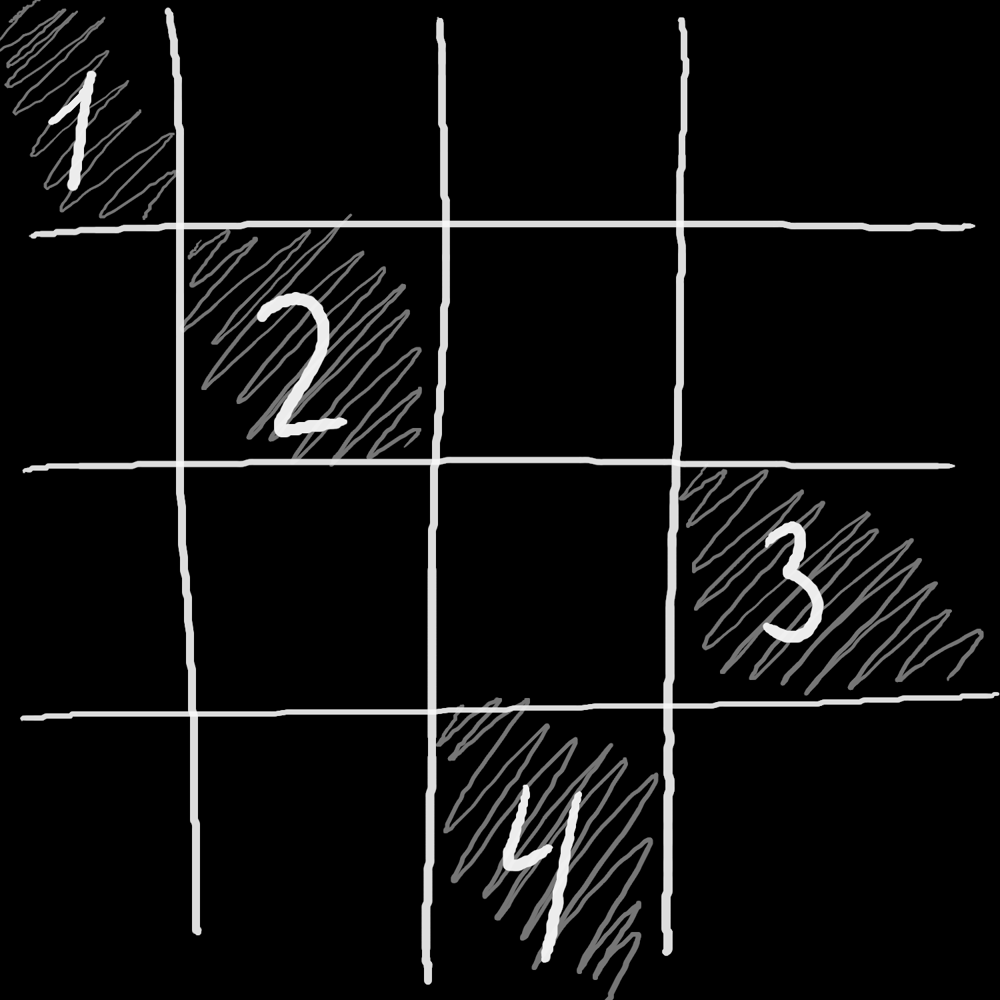
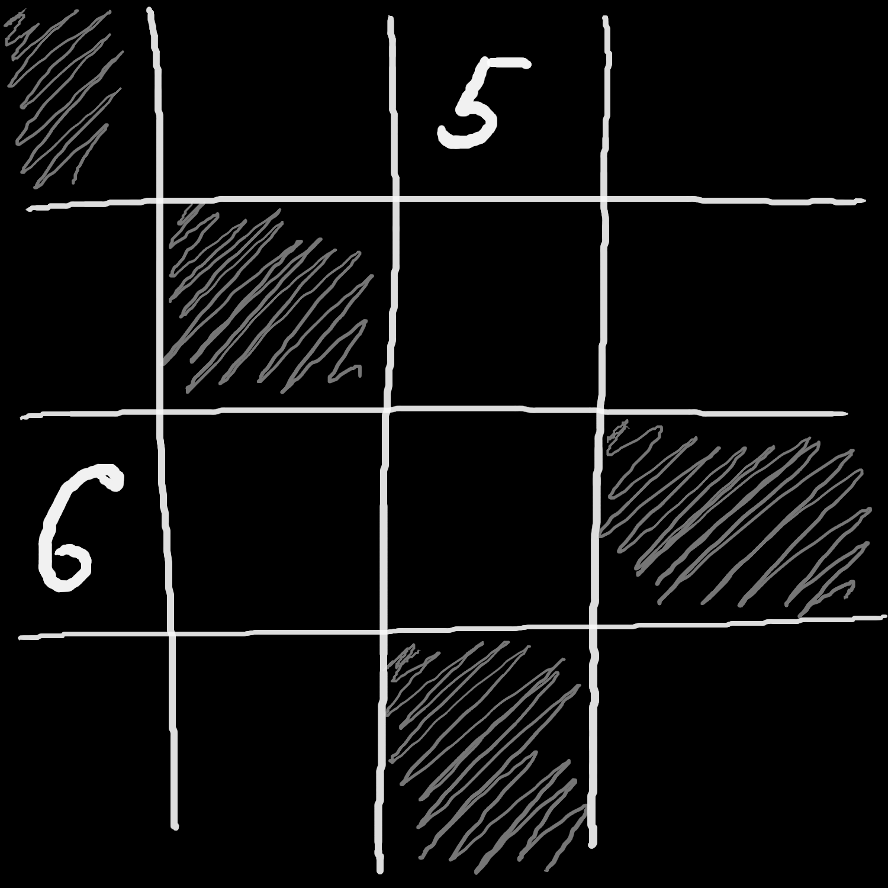
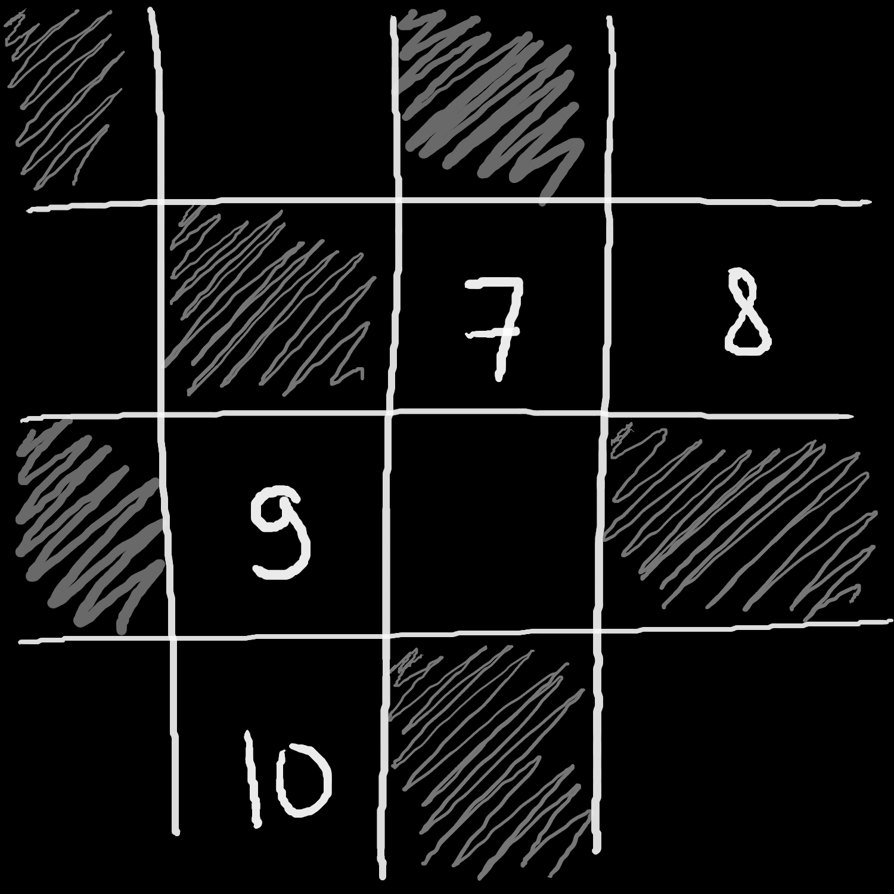
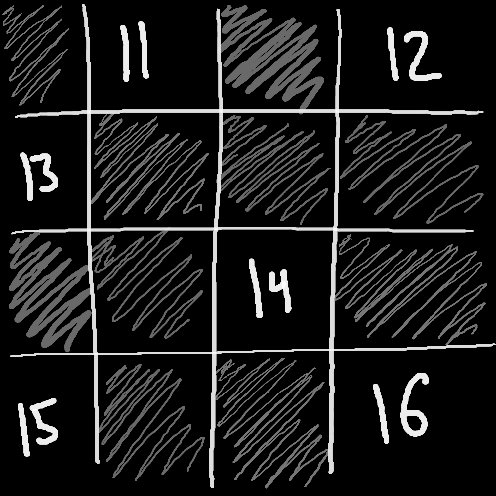

# Welcome to Ship Wars
Это фундаментальный проект на C++, в котором полноценно реализованы принципы парадигмы ООП данного языка.
Конечно, следует написать для полноты картины этот README и на английском, но может именно ты, дорогой читатель, сделаешь issue с таким предложением? Ладно-ладно, я пошутил, закрывай свой блокнот и читай дальше, так как есть задачи и по важнее для данного проекта, чем английская читалка.

## Быстрый запуск


не забудь здесь просто параметр -v

## Сущности
- Процессор - обработчик команд;
- Ядро игры;
- Хранение поля и кораблей: моего и врага;
- Стратегии;
- Парсер;
- Обработчик ошибок;

А теперь подробнее.

## Обработчик команд (Proccesor)

Хорошее название, главное - верное, так как именно он будет заниматься всем: администрированием игры и ее руководством.\
Этот объект отвечает за весь ввод потока и вывода, и - при необходимости, а точнее, если только это возможно - делегирует его другим сущностям.

| Команда                      | Ответ          | Описание |
| -------                      | -----          | --------                                    |
| ping                         |  pong          |   тестовая команда                          |
| exit                         |  ok            |   программа завершается                     |
| create [master,slave]        |  o            |   создать игру в режиме master или slave соответственно       |
| start                        |  ok            |   старт игры                     |
| stop                         |  ok            |   остановка текущей партии       |
| set width  N                 |  ok/failed     |   установить ширину поля (N положительное, влезает в uint64_t)       |
| get width                    |  N             |   получить длину поля  (N положительное, влезает в uint64_t)      |
| set height N                 |  ok/failed     |   установить высоту поля (N положительное, влезает в uint64_t)        |
| get height                   |  N             |   получить высоту поля  (N положительное, влезает в uint64_t)      |
| set count [1,2,3,4]  N       |  ok/failed     |   установить количество кораблей определенного типа (N положительное, влезает в uint64_t)        |
| get count [1,2,3,4]          |  N             |   получить количество кораблей определенного типа (N положительное, влезает в uint64_t)        |
| set strategy [ordered,custom]|  ok            |   выбрать стратегию для игры        |
| shot X Y                     |  miss/hit/kill |   выстрел по вашим короаблям в координатах (X,Y) (X,Y положительные, влезают в uint64_t)      | 
| shot                         |  X Y           |   вернуть координаты вашего следующего выстрела, в ответе два числа через пробел  (X,Y положительные, влезают в uint64_t)       |
| set result [miss,hit,kill]   |  ok            |   установить результат последнего выстрела программы       |
| finished                     |  yes/no        |   окончена ли текущая партия       |
| win                          |  yes/no        |   являетесь ли вы победителем       |
| lose                         |  yes/no        |   являетесь ли вы проигравшим       |
| dump PATH                    |  ok            |   сохранить размер поля и вашу текущую расстановку кораблей в файл        |
| load PATH                    |  ok            |   загрузить размер поля и расстановку кораблей из файла      |
| print                         |  ok     |   печатает карту       |

Здесь реализована полноценная инкапсуляция методов, для того чтобы логика следования друг за другом команд не зависила от их реализации(в процессоре любая реализация какой-либо команды состоит в том, какие же необходимые команды ядра нужно задействовать и корректно ли в контексте программы их выполнение(проверка на корректность команды производиться тут же).

Думаю, однозначно будет интересно просмотреть, каким же точным образом будут следовать друг за другом команды, так что вот дерево команд, обозначающее корректную иерархию следования команд.

### Дерево команд


## Ядро игры (Kernel)

Здесь содержаться все настройки игры, выбранный тип стратегии, и нужные размеры поля и кораблей.

1. Тип игрока: мастер или слуга(master or slave);
2. Размер поля;
3. Выбранная стратегия;
4. Количество соответственных кораблей;
5. Статус игры: выиграли или нет;
6. Cобственное поле;

> В чём различия игроков типа master/slave:

Согласно [условиям задачи](TASK.md) master игрок создает поле, зато slave игрок ходит первым.

Данная сущность выполняет все команды, которые запрашивает процессор, делегируя их или сразу запрашивая у соответственных структур ответ на нужный вопрос. Очень полезный уровень абстракции, чтобы отделить логические нужные действия для выполнения того или иного действия, не рассматривая всю техническую часть того или иного процесса.

## Хранение поля и кораблей (Map)

Данная структура данных должна оптимально хранить информацию о поле.
По условию задачи было поставлены цель в 64Mb потребления памяти всей программы. Ну что ж. Реализация действительно оптимально расходует память, но при максимальных входных данных будет расходовать на порядок больше, чем 64Mb (суммарно все возможные пути хранения информации).
Каждое поле есть перечень из всех исследованных клеток, в которых, если говорить про поле врага, находится промах или часть корабля - может быть, и уже подбитого.
Конечно, было бы гениально реализовать архиватор, который бы сжимал поле до приемлемых размеров и получал нужную область(часть поля) при каком-либо действии, но пока это стоит просто оставить как дополнительную задачу на будущее.

> P.S. При сдаче работы моему лаборанту было упомянута идея хранения данных о поле в файле, для того чтобы изменить способ хранения поля в оперативной памяти на жесткий диск, однако проблема краевых входных значений всё же существует, и её можно решить только ленивой настройкой, введениями ограничений.

Поле самостоятельно генерируется исходя из выбранных настроек. (стратегии (master) или соперника (slave)).

Поле: [boost хэш множество](https://www.boost.org/doc/libs/1_38_0/doc/html/boost/unordered_set.html), которая дает возможность обращаться по значению, представленного в виде пары координат [x и y](https://stackoverflow.com/questions/32685540/why-cant-i-compile-an-unordered-map-with-a-pair-as-key).

Генерация поля выполняется <u>максимально</u> эффективно по расположению кораблей относительно друг друга.\
Во-первых, алгоритм расставляет корабли таким образом, чтобы _убивать_ как можно меньше территории вокруг, тем самым, давая возможность будущим кораблям больше возможного места на выбор. Ситуация, когда возможна единственная расстановка как раз и учитывается данным алгоритмом.\
Немного технической части работы алгоса:

| x | x | x |
| - | - | - |
| x | ⏚ | x |
| x | x | x |

| x | x | x | x |
| - | - | - | - |
| x | ⏚ | ⏚ | x |
| x | x | x | x |

| x | x | x | x | x |
| - | - | - | - | - |
| x | ⏚ | ⏚ | ⏚ | x |
| x | x | x | x | x |

| x | x | x | x | x | x |
| - | - | - | - | - | - |
| x | ⏚ | ⏚ | ⏚ | ⏚ | x |
| x | x | x | x | x | x |

Это мертвые зоны для каждого типа корабля. Наш алгоритм будет использовать максимальное количество клеток "хороших" мёртвых зон, для того чтобы эффективно использовать пространство. Что такое "хорошая" мёртвая зона? Это та зона, которая уже используется для другого объекта.
То есть, если у нас примерно такая ситуация, то 3х палубник эффективно разместить следующим образом:

| x | x | x | x | x | x |
| - | - | - | - | - | - |
| x | ⏚ | x | x | x | x |
| x | x | x | x | x | x |

Вот так:
| x | x | x | x | x | ⏚ |
| - | - | - | - | - | - |
| x | ⏚ | x | x | x | ⏚ |
| x | x | x | x | x | ⏚ |

(или так):
| x | x | x | ⏚ | x | x |
| - | - | - | - | - | - |
| x | ⏚ | x | ⏚ | x | x |
| x | x | x | ⏚ | x | x |

А не:
| x | x | x | x | ⏚ | x |
| - | - | - | - | - | - |
| x | ⏚ | x | x | ⏚ | x |
| x | x | x | x | ⏚ | x |

Так как при выборе последней расстановки мы никогда не сможем разместить еще один корабль 🧏‍♀️!

Также алгоритму расстановки кораблей характерно расстанвливать все [2, 3, 4]-x палубные корабли _по углам_, а оставшиеся 1-палубные случайным образом по центру карты, если сущесвтует возможности такой расстановки.

### Примеры расстановок:

- Поле 10x10 ([файл конфигурации](assets/map10.txt))
```
⏚ ⏝ ⏚ ⏝ ⏚ ⏝ ⏚ ⏝ ⏝ ⏚
⏚ ⏝ ⏚ ⏝ ⏚ ⏝ ⏚ ⏝ ⏝ ⏝
⏚ ⏝ ⏚ ⏝ ⏝ ⏝ ⏝ ⏝ ⏝ ⏚
⏚ ⏝ ⏚ ⏝ ⏝ ⏝ ⏝ ⏝ ⏝ ⏝
⏝ ⏝ ⏝ ⏝ ⏝ ⏝ ⏝ ⏝ ⏝ ⏚
⏚ ⏚ ⏚ ⏚ ⏝ ⏚ ⏚ ⏚ ⏝ ⏚
⏝ ⏝ ⏝ ⏝ ⏝ ⏝ ⏝ ⏝ ⏝ ⏝
⏚ ⏚ ⏚ ⏚ ⏝ ⏚ ⏚ ⏚ ⏝ ⏚
⏝ ⏝ ⏝ ⏝ ⏝ ⏝ ⏝ ⏝ ⏝ ⏚
⏚ ⏚ ⏚ ⏚ ⏝ ⏚ ⏚ ⏚ ⏝ ⏚
```

- Поле 15x2 ([файл конфигурации](assets/map15x2.txt))
```
⏚ ⏚ ⏚ ⏚ ⏝ ⏚ ⏚ ⏚ ⏚ ⏝ ⏚ ⏚ ⏚ ⏚ ⏝
⏝ ⏝ ⏝ ⏝ ⏝ ⏝ ⏝ ⏝ ⏝ ⏝ ⏝ ⏝ ⏝ ⏝ ⏝
```

- Поле 40x40 ([файл конфигурации](assets/map40.txt))
```
⏝ ⏝ ⏝ ⏝ ⏝ ⏝ ⏝ ⏝ ⏝ ⏝ ⏝ ⏝ ⏝ ⏝ ⏝ ⏝ ⏝ ⏝ ⏝ ⏝ ⏝ ⏝ ⏝ ⏝ ⏝ ⏝ ⏝ ⏝ ⏝ ⏝ ⏝ ⏝ ⏝ ⏝ ⏝ ⏝ ⏝ ⏝ ⏝ ⏝
⏝ ⏝ ⏝ ⏝ ⏝ ⏝ ⏝ ⏝ ⏝ ⏝ ⏝ ⏝ ⏝ ⏝ ⏝ ⏝ ⏝ ⏝ ⏝ ⏝ ⏝ ⏝ ⏝ ⏝ ⏝ ⏝ ⏝ ⏝ ⏝ ⏝ ⏝ ⏝ ⏝ ⏝ ⏝ ⏝ ⏝ ⏝ ⏝ ⏝
⏝ ⏝ ⏝ ⏝ ⏝ ⏝ ⏝ ⏝ ⏝ ⏝ ⏝ ⏝ ⏝ ⏝ ⏝ ⏝ ⏝ ⏝ ⏝ ⏝ ⏝ ⏝ ⏝ ⏝ ⏝ ⏝ ⏝ ⏝ ⏝ ⏝ ⏝ ⏝ ⏝ ⏝ ⏝ ⏝ ⏝ ⏝ ⏝ ⏝
⏝ ⏝ ⏝ ⏝ ⏝ ⏝ ⏝ ⏝ ⏝ ⏝ ⏝ ⏝ ⏝ ⏝ ⏝ ⏝ ⏝ ⏝ ⏝ ⏝ ⏝ ⏝ ⏝ ⏝ ⏝ ⏝ ⏝ ⏝ ⏝ ⏝ ⏝ ⏝ ⏝ ⏝ ⏝ ⏝ ⏝ ⏝ ⏝ ⏝
⏝ ⏝ ⏝ ⏝ ⏝ ⏝ ⏝ ⏝ ⏝ ⏝ ⏝ ⏝ ⏝ ⏝ ⏝ ⏝ ⏝ ⏝ ⏝ ⏝ ⏝ ⏝ ⏝ ⏝ ⏝ ⏝ ⏝ ⏝ ⏝ ⏝ ⏝ ⏝ ⏝ ⏝ ⏝ ⏝ ⏝ ⏝ ⏝ ⏝
⏝ ⏝ ⏝ ⏝ ⏝ ⏝ ⏝ ⏝ ⏝ ⏝ ⏝ ⏝ ⏝ ⏝ ⏝ ⏝ ⏝ ⏝ ⏝ ⏝ ⏝ ⏝ ⏝ ⏝ ⏝ ⏝ ⏝ ⏝ ⏝ ⏝ ⏝ ⏝ ⏝ ⏝ ⏝ ⏝ ⏝ ⏝ ⏝ ⏝
⏝ ⏝ ⏝ ⏝ ⏝ ⏝ ⏝ ⏝ ⏝ ⏝ ⏝ ⏝ ⏝ ⏝ ⏝ ⏝ ⏝ ⏝ ⏝ ⏝ ⏝ ⏝ ⏝ ⏝ ⏝ ⏝ ⏝ ⏝ ⏝ ⏝ ⏝ ⏝ ⏝ ⏝ ⏝ ⏝ ⏝ ⏝ ⏝ ⏝
⏝ ⏝ ⏝ ⏝ ⏝ ⏝ ⏝ ⏝ ⏝ ⏝ ⏝ ⏝ ⏝ ⏝ ⏝ ⏝ ⏝ ⏝ ⏝ ⏝ ⏝ ⏝ ⏝ ⏝ ⏝ ⏝ ⏝ ⏝ ⏝ ⏝ ⏝ ⏝ ⏝ ⏝ ⏝ ⏝ ⏝ ⏝ ⏝ ⏝
⏝ ⏝ ⏝ ⏝ ⏝ ⏝ ⏝ ⏝ ⏝ ⏝ ⏝ ⏝ ⏝ ⏝ ⏝ ⏝ ⏝ ⏝ ⏝ ⏝ ⏝ ⏝ ⏝ ⏝ ⏝ ⏝ ⏝ ⏝ ⏝ ⏝ ⏝ ⏝ ⏝ ⏝ ⏝ ⏚ ⏝ ⏝ ⏝ ⏝
⏚ ⏚ ⏝ ⏝ ⏝ ⏝ ⏝ ⏝ ⏝ ⏝ ⏝ ⏝ ⏝ ⏝ ⏝ ⏝ ⏝ ⏝ ⏝ ⏝ ⏝ ⏝ ⏝ ⏝ ⏝ ⏝ ⏝ ⏚ ⏝ ⏝ ⏝ ⏝ ⏝ ⏝ ⏝ ⏝ ⏝ ⏝ ⏝ ⏝
⏝ ⏝ ⏝ ⏝ ⏝ ⏝ ⏝ ⏝ ⏝ ⏝ ⏝ ⏝ ⏝ ⏝ ⏝ ⏝ ⏝ ⏝ ⏝ ⏝ ⏝ ⏝ ⏝ ⏝ ⏝ ⏝ ⏝ ⏝ ⏝ ⏝ ⏝ ⏝ ⏝ ⏝ ⏝ ⏝ ⏝ ⏝ ⏝ ⏝
⏚ ⏚ ⏝ ⏚ ⏚ ⏝ ⏝ ⏝ ⏝ ⏝ ⏝ ⏝ ⏝ ⏝ ⏝ ⏝ ⏝ ⏝ ⏝ ⏝ ⏝ ⏝ ⏝ ⏝ ⏝ ⏝ ⏝ ⏝ ⏝ ⏝ ⏝ ⏝ ⏝ ⏝ ⏝ ⏝ ⏝ ⏝ ⏝ ⏝
⏝ ⏝ ⏝ ⏝ ⏝ ⏝ ⏝ ⏝ ⏝ ⏝ ⏝ ⏝ ⏝ ⏝ ⏝ ⏝ ⏝ ⏝ ⏝ ⏝ ⏝ ⏝ ⏝ ⏝ ⏝ ⏝ ⏝ ⏝ ⏝ ⏝ ⏝ ⏝ ⏝ ⏝ ⏝ ⏝ ⏝ ⏝ ⏝ ⏝
⏚ ⏚ ⏝ ⏚ ⏚ ⏝ ⏝ ⏝ ⏝ ⏝ ⏝ ⏝ ⏝ ⏝ ⏝ ⏝ ⏝ ⏝ ⏝ ⏝ ⏝ ⏝ ⏝ ⏝ ⏝ ⏝ ⏝ ⏝ ⏝ ⏝ ⏝ ⏝ ⏝ ⏝ ⏝ ⏝ ⏝ ⏝ ⏝ ⏝
⏝ ⏝ ⏝ ⏝ ⏝ ⏝ ⏝ ⏝ ⏝ ⏝ ⏝ ⏝ ⏝ ⏝ ⏝ ⏝ ⏝ ⏝ ⏝ ⏝ ⏝ ⏝ ⏝ ⏝ ⏝ ⏝ ⏝ ⏝ ⏝ ⏝ ⏝ ⏝ ⏝ ⏝ ⏝ ⏝ ⏝ ⏝ ⏝ ⏝
⏚ ⏚ ⏚ ⏝ ⏚ ⏚ ⏚ ⏝ ⏝ ⏝ ⏝ ⏝ ⏝ ⏝ ⏝ ⏝ ⏝ ⏝ ⏝ ⏝ ⏝ ⏝ ⏝ ⏝ ⏝ ⏝ ⏝ ⏝ ⏝ ⏝ ⏝ ⏝ ⏝ ⏝ ⏝ ⏝ ⏝ ⏝ ⏝ ⏝
⏝ ⏝ ⏝ ⏝ ⏝ ⏝ ⏝ ⏝ ⏝ ⏝ ⏝ ⏝ ⏝ ⏝ ⏝ ⏝ ⏝ ⏝ ⏝ ⏝ ⏝ ⏝ ⏝ ⏝ ⏝ ⏝ ⏝ ⏝ ⏝ ⏝ ⏝ ⏝ ⏝ ⏝ ⏝ ⏝ ⏝ ⏝ ⏝ ⏝
⏚ ⏚ ⏚ ⏝ ⏚ ⏚ ⏚ ⏝ ⏝ ⏝ ⏝ ⏝ ⏝ ⏝ ⏝ ⏝ ⏝ ⏝ ⏝ ⏝ ⏝ ⏝ ⏝ ⏝ ⏝ ⏝ ⏝ ⏝ ⏝ ⏝ ⏝ ⏝ ⏝ ⏝ ⏝ ⏝ ⏝ ⏚ ⏝ ⏝
⏝ ⏝ ⏝ ⏝ ⏝ ⏝ ⏝ ⏝ ⏝ ⏝ ⏝ ⏝ ⏝ ⏝ ⏝ ⏝ ⏝ ⏝ ⏝ ⏝ ⏝ ⏝ ⏝ ⏝ ⏝ ⏝ ⏝ ⏝ ⏝ ⏝ ⏝ ⏝ ⏝ ⏝ ⏝ ⏝ ⏝ ⏝ ⏝ ⏝
⏚ ⏚ ⏚ ⏝ ⏚ ⏚ ⏚ ⏝ ⏝ ⏝ ⏝ ⏝ ⏝ ⏝ ⏝ ⏝ ⏝ ⏝ ⏝ ⏝ ⏝ ⏝ ⏝ ⏝ ⏝ ⏝ ⏝ ⏝ ⏝ ⏝ ⏝ ⏝ ⏝ ⏝ ⏝ ⏝ ⏝ ⏝ ⏝ ⏝
⏝ ⏝ ⏝ ⏝ ⏝ ⏝ ⏝ ⏝ ⏝ ⏝ ⏝ ⏝ ⏝ ⏝ ⏝ ⏝ ⏝ ⏝ ⏝ ⏝ ⏝ ⏝ ⏝ ⏝ ⏝ ⏝ ⏝ ⏝ ⏝ ⏝ ⏝ ⏝ ⏝ ⏝ ⏝ ⏝ ⏝ ⏝ ⏝ ⏝
⏚ ⏚ ⏚ ⏝ ⏚ ⏚ ⏚ ⏝ ⏝ ⏝ ⏝ ⏝ ⏝ ⏝ ⏝ ⏝ ⏝ ⏝ ⏝ ⏝ ⏝ ⏝ ⏚ ⏝ ⏝ ⏝ ⏚ ⏝ ⏝ ⏝ ⏝ ⏝ ⏝ ⏝ ⏝ ⏝ ⏝ ⏝ ⏝ ⏝
⏝ ⏝ ⏝ ⏝ ⏝ ⏝ ⏝ ⏝ ⏝ ⏝ ⏝ ⏝ ⏝ ⏝ ⏝ ⏝ ⏝ ⏝ ⏝ ⏝ ⏝ ⏝ ⏝ ⏝ ⏝ ⏝ ⏝ ⏝ ⏝ ⏝ ⏝ ⏝ ⏝ ⏝ ⏝ ⏝ ⏝ ⏝ ⏝ ⏝
⏚ ⏚ ⏚ ⏚ ⏝ ⏚ ⏚ ⏚ ⏚ ⏝ ⏚ ⏚ ⏚ ⏝ ⏝ ⏝ ⏝ ⏝ ⏝ ⏝ ⏝ ⏝ ⏝ ⏝ ⏝ ⏝ ⏝ ⏝ ⏝ ⏝ ⏝ ⏝ ⏝ ⏝ ⏝ ⏝ ⏝ ⏝ ⏝ ⏝
⏝ ⏝ ⏝ ⏝ ⏝ ⏝ ⏝ ⏝ ⏝ ⏝ ⏝ ⏝ ⏝ ⏝ ⏝ ⏝ ⏝ ⏝ ⏝ ⏝ ⏝ ⏝ ⏝ ⏝ ⏝ ⏝ ⏝ ⏝ ⏝ ⏝ ⏝ ⏝ ⏝ ⏝ ⏝ ⏝ ⏝ ⏝ ⏝ ⏝
⏚ ⏚ ⏚ ⏚ ⏝ ⏚ ⏚ ⏚ ⏚ ⏝ ⏚ ⏚ ⏚ ⏝ ⏝ ⏝ ⏝ ⏝ ⏝ ⏝ ⏝ ⏝ ⏝ ⏝ ⏝ ⏝ ⏝ ⏝ ⏝ ⏝ ⏝ ⏝ ⏝ ⏝ ⏝ ⏝ ⏝ ⏝ ⏝ ⏝
⏝ ⏝ ⏝ ⏝ ⏝ ⏝ ⏝ ⏝ ⏝ ⏝ ⏝ ⏝ ⏝ ⏝ ⏝ ⏝ ⏝ ⏝ ⏝ ⏝ ⏝ ⏝ ⏝ ⏝ ⏝ ⏝ ⏝ ⏝ ⏝ ⏝ ⏝ ⏝ ⏝ ⏝ ⏝ ⏝ ⏝ ⏝ ⏝ ⏝
⏚ ⏚ ⏚ ⏚ ⏝ ⏚ ⏚ ⏚ ⏚ ⏝ ⏚ ⏚ ⏚ ⏚ ⏝ ⏚ ⏝ ⏚ ⏝ ⏝ ⏝ ⏝ ⏝ ⏝ ⏝ ⏝ ⏝ ⏝ ⏝ ⏝ ⏝ ⏝ ⏝ ⏝ ⏝ ⏝ ⏝ ⏝ ⏝ ⏝
⏝ ⏝ ⏝ ⏝ ⏝ ⏝ ⏝ ⏝ ⏝ ⏝ ⏝ ⏝ ⏝ ⏝ ⏝ ⏚ ⏝ ⏚ ⏝ ⏝ ⏝ ⏝ ⏝ ⏝ ⏝ ⏝ ⏝ ⏝ ⏝ ⏝ ⏝ ⏝ ⏝ ⏝ ⏝ ⏝ ⏝ ⏝ ⏝ ⏝
⏚ ⏚ ⏚ ⏚ ⏝ ⏚ ⏚ ⏚ ⏚ ⏝ ⏚ ⏚ ⏚ ⏚ ⏝ ⏚ ⏝ ⏚ ⏝ ⏝ ⏝ ⏝ ⏝ ⏝ ⏝ ⏝ ⏝ ⏝ ⏝ ⏝ ⏝ ⏝ ⏝ ⏝ ⏝ ⏝ ⏝ ⏝ ⏝ ⏝
⏝ ⏝ ⏝ ⏝ ⏝ ⏝ ⏝ ⏝ ⏝ ⏝ ⏝ ⏝ ⏝ ⏝ ⏝ ⏝ ⏝ ⏝ ⏝ ⏝ ⏝ ⏝ ⏝ ⏝ ⏝ ⏝ ⏝ ⏝ ⏝ ⏝ ⏝ ⏝ ⏝ ⏝ ⏝ ⏝ ⏝ ⏝ ⏝ ⏝
⏚ ⏚ ⏚ ⏚ ⏝ ⏚ ⏚ ⏚ ⏚ ⏝ ⏚ ⏚ ⏚ ⏚ ⏝ ⏚ ⏚ ⏚ ⏚ ⏝ ⏚ ⏚ ⏚ ⏝ ⏚ ⏚ ⏝ ⏝ ⏝ ⏝ ⏝ ⏝ ⏝ ⏝ ⏝ ⏝ ⏝ ⏝ ⏝ ⏝
⏝ ⏝ ⏝ ⏝ ⏝ ⏝ ⏝ ⏝ ⏝ ⏝ ⏝ ⏝ ⏝ ⏝ ⏝ ⏝ ⏝ ⏝ ⏝ ⏝ ⏝ ⏝ ⏝ ⏝ ⏝ ⏝ ⏝ ⏝ ⏝ ⏝ ⏝ ⏝ ⏝ ⏝ ⏝ ⏝ ⏝ ⏝ ⏝ ⏝
⏚ ⏚ ⏚ ⏚ ⏝ ⏚ ⏚ ⏚ ⏚ ⏝ ⏚ ⏚ ⏚ ⏚ ⏝ ⏚ ⏚ ⏚ ⏚ ⏝ ⏚ ⏚ ⏚ ⏝ ⏚ ⏚ ⏝ ⏝ ⏝ ⏝ ⏝ ⏝ ⏝ ⏝ ⏝ ⏝ ⏝ ⏝ ⏝ ⏝
⏝ ⏝ ⏝ ⏝ ⏝ ⏝ ⏝ ⏝ ⏝ ⏝ ⏝ ⏝ ⏝ ⏝ ⏝ ⏝ ⏝ ⏝ ⏝ ⏝ ⏝ ⏝ ⏝ ⏝ ⏝ ⏝ ⏝ ⏝ ⏝ ⏝ ⏝ ⏝ ⏝ ⏝ ⏝ ⏝ ⏝ ⏝ ⏝ ⏝
⏚ ⏚ ⏚ ⏚ ⏝ ⏚ ⏚ ⏚ ⏚ ⏝ ⏚ ⏚ ⏚ ⏚ ⏝ ⏚ ⏚ ⏚ ⏚ ⏝ ⏚ ⏚ ⏚ ⏝ ⏚ ⏚ ⏚ ⏝ ⏚ ⏚ ⏝ ⏝ ⏝ ⏝ ⏝ ⏝ ⏝ ⏝ ⏝ ⏝
⏝ ⏝ ⏝ ⏝ ⏝ ⏝ ⏝ ⏝ ⏝ ⏝ ⏝ ⏝ ⏝ ⏝ ⏝ ⏝ ⏝ ⏝ ⏝ ⏝ ⏝ ⏝ ⏝ ⏝ ⏝ ⏝ ⏝ ⏝ ⏝ ⏝ ⏝ ⏝ ⏝ ⏝ ⏝ ⏝ ⏝ ⏝ ⏝ ⏝
⏚ ⏚ ⏚ ⏚ ⏝ ⏚ ⏚ ⏚ ⏚ ⏝ ⏚ ⏚ ⏚ ⏚ ⏝ ⏚ ⏚ ⏚ ⏚ ⏝ ⏚ ⏚ ⏚ ⏝ ⏚ ⏚ ⏚ ⏝ ⏚ ⏚ ⏝ ⏝ ⏝ ⏝ ⏝ ⏝ ⏝ ⏝ ⏝ ⏝
⏝ ⏝ ⏝ ⏝ ⏝ ⏝ ⏝ ⏝ ⏝ ⏝ ⏝ ⏝ ⏝ ⏝ ⏝ ⏝ ⏝ ⏝ ⏝ ⏝ ⏝ ⏝ ⏝ ⏝ ⏝ ⏝ ⏝ ⏝ ⏝ ⏝ ⏝ ⏝ ⏝ ⏝ ⏝ ⏝ ⏝ ⏝ ⏝ ⏝
⏚ ⏚ ⏚ ⏚ ⏝ ⏚ ⏚ ⏚ ⏚ ⏝ ⏚ ⏚ ⏚ ⏚ ⏝ ⏚ ⏚ ⏚ ⏚ ⏝ ⏚ ⏚ ⏚ ⏝ ⏚ ⏚ ⏚ ⏝ ⏚ ⏚ ⏝ ⏝ ⏝ ⏝ ⏝ ⏝ ⏝ ⏝ ⏝ ⏝
```

## Стратегии

При проектировании архитектуры игры было решено объединить задачи: выбора настроек игры и тактикой совершения выстрелов в данный блок.
Конечно, это не лучшее логическое решение, так как возникают большие сложности при смене именно стратегии ведения боя во время игры. Cтоит разделить данный функции в раздельные сущности.
Но несмотря на такой ход при разработке, игра осуществила поставленные требования и предоставила возможность пользователю сразиться с ИИ!

### Ordered

Стратегия выполняет перебор в ширину, начиная с верхней левой клетки поля, заканчивая нижней правой. Примитивная логика, которая, к слову, выиграла не последнее место на проведённом соревновновании среди нашего курса!



### Custom

Сложная, но оправдання стратегия. Её смысл заключается в переборе ячеек по группам 4x4, для того чтобы максимально быстро уничтожить большие корабли, а с ними и метрвую зону вокруг.

Схематичная последовательность выстрелов группы 4x4(в дальнейшем `chunk`):



Каждый `chunk` уничтожается по опредёлнному перебору, позволяющий разбить точное уничтожение каждого типа корабля на 4 этапа:

- Поиск 4-х палубных кораблей (линкоры):


- Поиск 3-х палубных кораблей (крейсеры):


- Поиск 2-х палублных кораблей (эсминцы):


- Поиск 1 палубных кораблей (торпедные катеры):


> Главная особенность данного перебора состоит в том, что `chunk`s перебираются последовательно согласно этапам, а не цельно по-одному. Это позволяет с большей вероятностью найти максимальный корабль за вероятное наименьшее число шагов.

### Experiments (hard code support)

Была построена во время отладки и создания custom стратегии. Основана на рандомизированном переборе ячеек.
Для того чтобы её подключить, необходимо либо заменить в исходном коде используемый класс стратегии, либо расширить функционал выбора, создав новую команду.

## Парсер (Parser)

Формат:

```
width height
size [type] (coords)
size [type] (coords)
...
```

`width` - ширина

`height` - высота

`size` - размер [1, 2, 3, 4]

`type` - направление [h(horizontally) / v(vertically)]

`coords` - координаты левого верхнего угла (x, y)

Пример

```
10 10
1 v 0 0
2 h 3 4
4 h 1 8
```

# UB (Undefined Behavior)
При разработке было не покрыто следующее неопределённое поведение: при отстреле всех существующих ячеек и неправильном информировании программы о попадании возможна ситуация, когда программа отстреляет все ячейке, не выиграв. Это вызовет UB, а точнее - Segmetention fault.
Пример:
```
🏴‍☠️ Welcome to Ship Wars!
create slave
ok
set width 8
ok
set height 4
ok
set count 1 1
ok
start
ok
shot  
0 0
shot
1 1
...
shot
7 3
shot
AddressSanitizer:DEADLYSIGNAL
=================================================================
==22722==ERROR: AddressSanitizer: SEGV on unknown address 0x00000000003f (pc 0x000105d71fe1 bp 0x7ff7ba1b82b0 sp 0x7ff7ba1b8260 T0)
==22722==The signal is caused by a READ memory access.
==22722==Hint: address points to the zero page.
    #0 0x105d71fe1 in Coords::operator==(Coords const&) const+0x41 (ship-wars:x86_64+0x10002bfe1)
    #1 0x105de11a3 in std::__1::__wrap_iter<Coords const*> std::__1::find[abi:v160006]<std::__1::__wrap_iter<Coords const*>, Coords>(std::__1::__wrap_iter<Coords const*>, std::__1::__wrap_iter<Coords const*>, Coords const&)+0x193 (ship-wars:x86_64+0x10009b1a3)
    #2 0x105de0a21 in CustomStrategy::next_()+0xd71 (ship-wars:x86_64+0x10009aa21)
    #3 0x105ddaf13 in CustomStrategy::search_()+0x123 (ship-wars:x86_64+0x100094f13)
    #4 0x105dda947 in CustomStrategy::Shot()+0x1b7 (ship-wars:x86_64+0x100094947)
    #5 0x105d4bff4 in Kernel::Shot()+0x164 (ship-wars:x86_64+0x100005ff4)
    #6 0x105d651e5 in Processor::Shot()+0x2f5 (ship-wars:x86_64+0x10001f1e5)
    #7 0x105d61fbb in Processor::Run(bool)+0xc8b (ship-wars:x86_64+0x10001bfbb)
    #8 0x105d4a057 in main+0x157 (ship-wars:x86_64+0x100004057)
    #9 0x7ff80a1a2417 in start+0x767 (dyld:x86_64+0xfffffffffff6e417)
```
